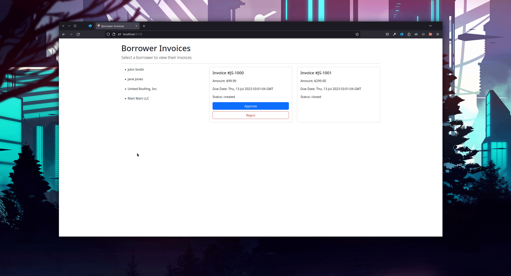

# Invoices 'R Us

Have fun playing around with the various state transitions for borrower invoices.

## Setup

NOTE: Unless otherwise specified, commands should be run from the same directory in which this README is located.

1. Install [asdf](https://asdf-vm.com/guide/getting-started.html).

1. Install `asdf` plugins:
    - [asdf-nodejs](https://github.com/asdf-vm/asdf-nodejs): `asdf plugin add nodejs`
    - [asdf-python](https://github.com/asdf-community/asdf-python): `asdf plugin-add python`

1. Install language runtimes using `asdf`: `asdf install`

1. Install dependencies:
    1. Backend:
        1. Initialize virtual environment: `source bin/activate`
        1. Install dependencies: `pip install -r requirements.txt`
        1. Init the database: `flask --app flaskr init-db`
    1. Frontend: `cd ./frontend && npm install`

## Running the App

1. To run the backend: `flask --app flaskr run --debug`

1. To run the frontend: `cd ./frontend/ && npm run dev`

In your browser, visit the URL displayed when running the frontend to view the application.

## Running Tests

### Backend

`pytest`

### Frontend

`cd ./frontend && npm run test`

## Things to Note

- This app uses a state machine to prevent invoices from making invalid state transitions.
- This app uses Flask Blueprints to organize code.
- This app does not currently use an ORM for the sake of simplicity and uses SQLite3 as its DB for the same reason.
- Original gist with challenge and instructions: https://gist.github.com/thiagosil/ee725fa09c796a1b5727afaac07c6bc7
- This project was adapted from a Rails template repository: https://github.com/Finvoice/xen_base_challenge

## Contributing

See `CONTRIBUTING.md` in this directory.
